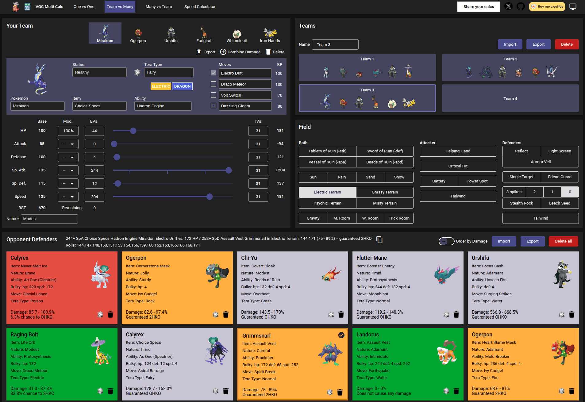
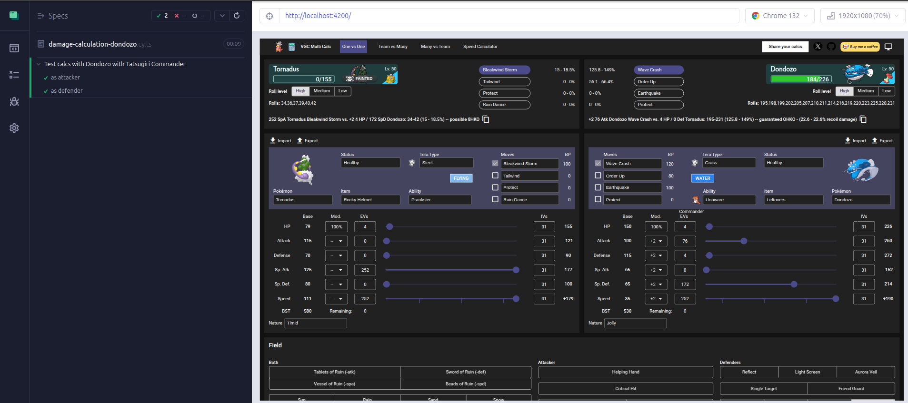

# VGC Multi Calc

[](https://sonarcloud.io/summary/new_code?id=robsonbittencourt_vgc-multicalc)

> This is a non-profit project, created by a fan for the Pokémon community.

[VGC Multi Calc](https://vgcmulticalc.com) is a damage calculator for Pokémon games, focusing on the latest versions, currently Scarlet and Violet, and the official VGC competitive format. It aims to stand out with its design, ease of use, and calculations not found in other alternatives.

In addition to calculations, it allows team building and has the ability to import and export results to [Pokémon Showdown](https://play.pokemonshowdown.com/).

## Access the site here: [vgcmulticalc.com](https://vgcmulticalc.com)



## :electric_plug: Getting Started

### Prerequisites

To run this project locally, ensure you have the following tools installed:

- Node.js v18

```
# Install nvm
curl -o- https://raw.githubusercontent.com/nvm-sh/nvm/v0.40.1/install.sh | bash

# Install Node.js v18
nvm install 18

# Configure Node.js v18 to use
nvm use 18
```

- Angular CLI

```
npm install -g @angular/cli
```

### Installation

- Clone the repository:

```
git clone https://github.com/robsonbittencourt/vgc-multicalc.git
cd vgc-multi-calc
```

- Install dependencies:

```
npm install
```

### Running the Project

- Start the development server:

```
npm start
```

- Open your browser and navigate to:

```
http://localhost:4200
```

## :construction_worker: Architecture

The project runs entirely on the client side. All necessary data about Pokémon is contained within the bundle.

Below are some of the main points used in the architecture of this project.

### Angular

The Angular version used is the latest one. One key highlight is the use of [signals](https://angular.dev/guide/signals) for component reactivity. Since this project employs signals in all its components, it no longer uses zone.js, meaning it is a [zoneless](https://angular.dev/guide/experimental/zoneless) application and follows the most current Angular directives.

### NgRx Signal Store

The [NgRx Signal Store](https://ngrx.io/guide/signals) library serves as the foundation for state management throughout the application. It simplifies reactivity by creating signals for stored properties as needed.

### Smogon Damage Calc

All calculations are performed using the [damage-calc](https://github.com/smogon/damage-calc) library provided by [Smogon](https://www.smogon.com/). Abstractions were created to keep the library usage in isolated points, ensuring it doesn't mix with the project's code.

The most recent version of this project [published on NPM](https://www.npmjs.com/package/@smogon/calc) does not match the latest version on [GitHub](https://github.com/smogon/damage-calc). To address this, a [fork](https://github.com/robsonbittencourt/damage-calc) was created and is [published](https://www.npmjs.com/package/@robsonbittencourt/calc) as needed. This fork is referenced as a dependency in the [package.json](package.json).

### Project structure

```
src               // All the source of the bundle is here
├── app           // Angular components
│ ├── core        // Main components
│ ├── features    // Components by feature
│ └── shared      // Utility components
├── assets        // Assets like fonts and icons
├── data          // All the necessary data is here
└── lib           // Domain logic
```

### Deploy

The site is deployed using [Github Pages](https://pages.github.com/). Additionally, a DNS (vgcmulticalc.com) has been created and configured to redirect to the GitHub URL.

The project includes a pipeline in Github Actions that runs tests, linters, and deploys the application with every commit to the main branch.

## :white_check_mark: Tests

The project includes both unit test and E2E test suites.

### Unit Tests

The unit tests are executed using [Jasmine](https://jasmine.github.io) and [Karma](https://karma-runner.github.io). To run all the tests, use the following commands:

```
# Single run
npm test

# It automatically re-runs when the files are modified
npm run test-watch

```

You can view the test coverage report by opening the file /coverage/lcov-report/index.html. The coverage report is also available on the [project's Sonar Cloud](https://sonarcloud.io/summary/overall?id=robsonbittencourt_vgc-multicalc&branch=main).

### E2E Tests

The End-To-End tests are written and executed with [Cypress](https://www.cypress.io). To run the tests, use the following commands:

```
# Run directly from the terminal
npx cypress run --quiet

# Run in interactive mode
npx cypress open
```



## :sparkles: Acknowledgments

- [Smogon](https://www.smogon.com/) for providing the original calculator and so many other tools :trophy:

- Thanks to the VGC Community for the feedback and support :heart:

## :octocat: Contributing

Contributions are welcome. Feel free to submit a PR or open an issue. If you have any questions, you can find me on [X/Twitter](https://twitter.com/rluizv).

## :book: License

This project is licensed under the MIT License. See the [LICENSE](LICENSE) file for details.
