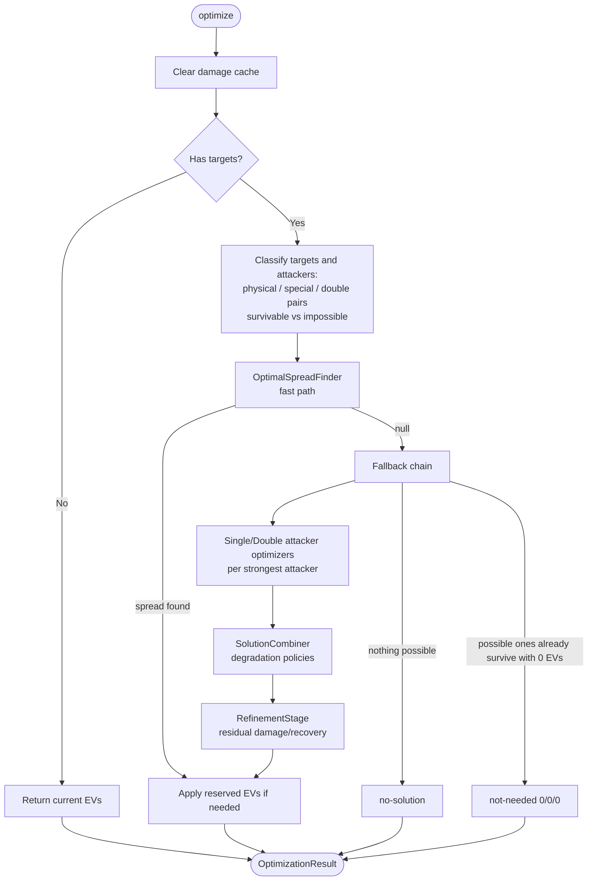

# Defensive EV Optimizer

## Overview

The Defensive EV Optimizer calculates optimal EV (Effort Value) distributions for defensive Pokémon in VGC battles. It determines the minimum EV investment in HP, Defense, and Special Defense required to survive attacks from one or more opposing Pokémon (single attackers and/or pairs attacking together).

The optimizer returns an `OptimizationResult` containing the optimized EVs, an optional nature recommendation, and a status (`success`, `not-needed`, `no-solution`). It supports a configurable `SurvivalThreshold` (2, 3 or 4, default 2), meaning: survive the accumulated damage up to turn `threshold - 1` (hits plus end-of-turn residuals such as burn chip or Leftovers recovery).

## Business Policy: Protect What Is Possible

An attacker (or attacker pair) is **impossible** when the defender cannot survive it even with maximum defensive investment. Impossible threats are lost causes:

- They are discarded from optimization and never become the "strongest" of their category.
- They never abort the result: the optimizer protects every threat that can be protected.
- `no-solution` is returned only when **no** threat in the list is possible.
- Trivial threats (survived with 0 EVs) and immune matchups (zero damage) count as possible.

## Architecture

### Fast path: OptimalSpreadFinder

The finder handles the vast majority of cases in a single pass:

1. Builds the constraint sets: `[strongest physical + survivable physicals]`, `[strongest special + survivable specials]`, and the strongest possible double pair.
2. For each HP value (ascending over the EV intervals), binary-searches the minimum Def that survives all physical constraints and the minimum SpD that survives all special constraints; for the double pair, escalates Def while binary-searching SpD.
3. Tracks the best candidate (lowest total EVs; ties broken by higher HP) with early breaks once no better total is reachable.
4. Applies a final greedy −4 polish (hp → def → spd).

If the finder returns a spread, nothing else runs. It only fails on genuine budget conflicts (each side fits 508 individually, but the joint requirement does not) — that is the single gateway into the fallback chain.

### Fallback chain

When the finder fails, the legacy chain computes per-category solutions (`SingleAttackerOptimizer`, `DoubleAttackerOptimizer`) for the strongest attackers only, and `SolutionCombiner` applies degradation policies:

- Drop single solutions already covered by the double solution.
- Combine physical + special by priority (survivable-count based), squeezing the other side's stat into the remaining budget.
- If the squeezed side no longer survives its strongest attacker, fall back to protecting the second strongest of that category.
- Combine a single-category solution with the double solution via a joint Def/SpD search.

The re-checks against the strongest pair inside `combineSolutions` are reachable: the finder can fail because of a _list_ attacker (a weaker-in-damage but more-expensive-to-survive threat — possible with HP-non-monotonic mechanics such as a Sitrus Berry defender) while the strongest pair itself remains coverable.

### RefinementStage

Runs only in the fallback and only when the KO chance text mentions residuals (`after ... damage` / `after ... recovery`, computed against the original 0-EV defender):

- If the candidate spread survives: `reduceEvs` (greedy −4). HP is already maximized at equal total by the finder's `pickBest` tie-break, so no separate HP-shift step runs here.
- Double-attacker path only: if it does not survive and the residual is damage (burn, sand), `increaseEvs` bumps HP/Def/SpD round-robin by +4 until survival or exhaustion.

The single-attacker path has no increase ramp: its input spreads come from optimizers that already guarantee survival by construction.

## Damage Cache (`CachedDamageCalc`)

All survival checks share a `DamageCalc` subclass that caches per-stat damage results:

- Key: attacker reference (WeakMap id), move name, second attacker, side orientation, and the defender's Def/SpD (HP joins the key only for Berry holders, whose consumption is HP-dependent).
- Only `damage` and `rawDesc` are cached — never the whole `Result`, because results capture the defender reference and multi-turn math reads its current HP.
- Cache misses store the prepared calculation, so subsequent hits rebuild a `Result` cheaply against the live defender.
- The cache is cleared at the start of every `optimize()` call.

## Attacker Selection and Priority

`AttackerSelector` classifies each attacker by category and survival class:

- **survivable**: needs investment (dies at 0 EVs, lives at max).
- **impossible**: dies even at max investment — excluded from strongest selection and constraints.
- **trivial/immune**: survives at 0 EVs — no constraint, still "possible".

The strongest attacker per category is the highest one-turn damage among non-impossible attackers. With `updateNature = true`, Def- and SpD-boosting natures are compared by total survivable count (max damage as tiebreaker). Double pairs are selected by combined damage among pairs survivable at max investment; unsurvivable pairs are skipped.

## EV Intervals

EVs are tested only at stat-changing breakpoints:

`[0, 4, 12, 20, ..., 244, 252]` (33 values)

## Constants

- **`MAX_TOTAL_EVS`**: 508
- **`MAX_SINGLE_STAT_EVS`**: 252

## Reserved EVs Support

With `keepOffensiveEvs = true`, existing ATK/SPA/SPE EVs are preserved and validated against the 508 total; exceeding it yields `no-solution`.

## Performance

The heavy reference case (mixed double target + single attacker vs Ting-Lu) runs in ~20ms (was ~730ms before the cache + finder rework — 36x). The performance spec enforces a 200ms budget. Key levers:

1. Damage cache shared by every internal service (5-15x redundancy eliminated).
2. Finder-first flow: the combiner/refinement chain only runs on budget conflicts.
3. Direct ordered sweeps and binary searches over the 33-value interval grid.
4. Mutable `setEvs()` instead of cloning inside tight loops.

## Limitations

- Only HP/DEF/SPD are optimized; offensive EVs can be preserved, not optimized.
- Survival uses the configured roll index (default: maximum damage roll) and ignores critical hits.
- Damage is modeled as constant per turn (stat-stage escalation like Torch Song is not projected across turns).
- Nature selection considers defensive natures only.
