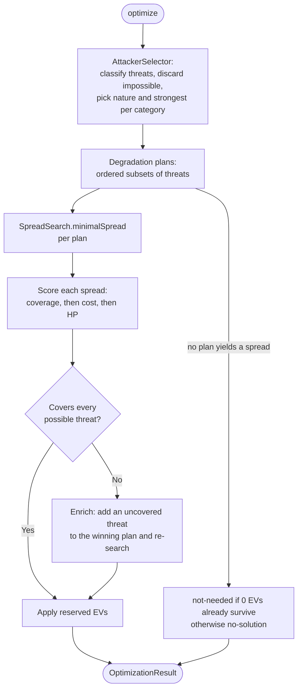

# Defensive EV Optimizer

## Overview

The Defensive EV Optimizer calculates optimal EV (Effort Value) distributions for defensive Pokémon in VGC battles. It determines the minimum EV investment in HP, Defense, and Special Defense required to survive attacks from one or more opposing Pokémon (single attackers and/or pairs attacking together).

The optimizer returns an `OptimizationResult` containing the optimized EVs, an optional nature recommendation, and a status (`success`, `not-needed`, `no-solution`). It supports a configurable `SurvivalThreshold` (2, 3 or 4, default 2), meaning: survive `threshold - 1` hits, including end-of-turn residuals such as burn chip or Leftovers recovery.

## Business Policy

### Survival Is Decided by KO Chance

A threat is survived when the **chance of being KO'd within `threshold - 1` hits is exactly zero** — not when the damage accumulated at the configured roll index stays below HP. The same criterion applies to single attackers and to attacker pairs.

An attacker with an 18.4% chance to 2HKO therefore counts as **not** protected.

### The Roll Index Selects Which Rolls Count

"Zero KO chance" is evaluated over the rolls the user chose to care about, not always over all sixteen. `truncateToRoll` keeps the weakest `rollIndex + 1` of every 16 rolls and discards the rest, and the whole KO-chance simulation — berry timing, end-of-turn residuals, multi-hit — runs on that truncated distribution.

| roll level | `rollIndex` | rolls considered | meaning                                      |
| ---------- | ----------- | ---------------- | -------------------------------------------- |
| high       | 15          | all 16           | no roll may KO — the strictest reading       |
| medium     | 7           | the 8 weakest    | tolerates KOs that need an above-median roll |
| low        | 0           | the minimum only | only the minimum roll must be survived       |

Two consequences worth stating, both measured over 250 scenarios:

- **High roll is unchanged.** `truncateToRoll` returns the array untouched at index 15, so every spread the optimizer produced before this rule existed is produced identically.
- **Lowering the roll never costs more EVs for the same coverage.** Truncating removes KO paths, it never adds them, so the minimal surviving spread can only shrink. Where a lower roll _does_ report a larger spread, it is because the laxer bar turned a previously impossible threat into a protectable one, and the extra EVs buy that extra Pokémon — coverage rises, never falls.

Truncation must reach every place that reasons about "the worst thing that can happen", or the two halves disagree. `MultiResult.certainlyKOs` is the subtle one: it prunes a row using the **maximum** roll of each hit, and that maximum has to come from the truncated distribution too, otherwise the prune discards rows the user would actually survive.

The two criteria only disagree when the defender holds a healing item. Accumulated damage lets a Sitrus Berry absorb every hit, but the berry heals once, so it reports survival where a real KO chance exists. Two shapes of the error:

- **Single attacker** — Umbreon + Sitrus at 0 EVs vs Rotom-Heat Overheat (Grassy, threshold 3) reads as needing nothing, despite a 2% chance to 2HKO.
- **Pair** — Dondozo + Figy Berry at `20 HP / 60 SpD` (228 HP) vs Great Tusk + Iron Bundle reads as protected, while the real answer is a **31.3% chance to OHKO**. Pairs are worse because both hits land in the same turn, so crediting the berry between them is never valid.

The error is confined to berries: across 11,520 pair comparisons the criteria diverge 110 times (0.95%), **every one of them on a defender holding a Berry**.

Note that raw combined damage is _not_ a valid survival test for a pair either. The two attacks resolve in sequence, so a berry can legitimately trigger between them: a pair dealing 270–318 against 240 HP can still be a `guaranteed 2HKO`. Only `MultiResult.survivesHits` models the ordering correctly.

### Protect What Is Possible

An attacker (or attacker pair) is **impossible** when the defender cannot survive it even with maximum defensive investment. Impossible threats are lost causes:

- They are discarded from optimization and never become the "strongest" of their category.
- They never abort the result: the optimizer protects every threat that can be protected.
- `no-solution` is returned only when **no** threat in the list is possible.
- Trivial threats (survived with 0 EVs) and immune matchups (zero damage) count as possible.

### Coverage Beats Cost

When 508 EVs cannot cover every threat, the optimizer maximizes the **number of threats protected** first, and only then minimizes the EVs spent. A spread that protects one extra attacker always wins over a cheaper spread that protects fewer. Ties in coverage are broken by lower total EVs, then by higher HP.

## Architecture

Three concepts, one search engine:


```mermaid
flowchart TD
    Start([optimize]) --> Classify[AttackerSelector:<br/>classify threats, discard impossible,<br/>pick nature and strongest per category]
    Classify --> Plans[Degradation plans:<br/>ordered subsets of threats]
    Plans --> Search[SpreadSearch.minimalSpread<br/>per plan]
    Search --> Score[Score each spread:<br/>coverage, then cost, then HP]
    Score --> Full{Covers every<br/>possible threat?}
    Full -->|Yes| Reserved[Apply reserved EVs]
    Full -->|No| Enrich[Enrich: add an uncovered threat<br/>to the winning plan and re-search]
    Enrich --> Reserved
    Plans -->|no plan yields a spread| Epilogue[not-needed if 0 EVs already survive<br/>otherwise no-solution]
    Reserved --> End([OptimizationResult])
    Epilogue --> End
```

### `Threat`

A threat is one attacker or a pair attacking together. It answers `survivedBy(defender, ctx)` and declares which defensive stats it depends on (`def`, `spd`, or both). Single and double attackers share this one interface, so the rest of the optimizer never branches on which kind it holds.

**Single attacker** — `Result.survivesHits(threshold - 1)`, guarded by a cheap pre-filter: if HP minus the damage accumulated at the roll index still exceeds the maximum single roll, survival is certain and the expensive path is skipped.

**Pair** — `MultiResult.survivesHits(threshold - 1)`, with the pre-filter deliberately **absent**.

The asymmetry is deliberate and measured; it is the kind of thing that looks like an oversight and should not be "fixed" in either direction:

|        | pre-filter | why                                                                                                                                                                                                  |
| ------ | ---------- | ---------------------------------------------------------------------------------------------------------------------------------------------------------------------------------------------------- |
| single | present    | removing it costs 25% in aggregate, even though it prunes nothing in the worst case                                                                                                                  |
| pair   | absent     | `MultiResult.damageWithRemainingUntilTurn` runs `afterTurn`, walking ten turns and recomputing residuals — the guard costs about what the real answer costs. Ting-Lu: 41.6ms with it, 32.7ms without |

`MultiResult.survivesHits` recomputes end-of-turn damage rather than reading the stored `eot`. This is required for correctness: `CachedDamageCalc` keys `eot` on HP only for Berry holders, but Leftovers recovery is `maxHP / 16` and therefore HP-dependent, so a cached `eot` can be stale. Recomputing inside `survivesHits` keeps the cache key narrow — widening the key to include HP also fixes it, but costs 63% in cache misses.

### `SpreadSearch`

The single engine. Given a set of threats, it returns the minimal spread (HP/Def/SpD, each ≤ 252, total ≤ 508) that survives all of them, or `null`.

1. Threats are bucketed by the stats they depend on: Def-only, SpD-only, and coupled (mixed pairs, which need both).
2. For each HP value over the EV intervals, it finds the minimum Def that satisfies the Def-only threats and the minimum SpD for the SpD-only ones; for coupled threats it escalates Def while searching SpD.
3. Candidates are ranked by total EVs ascending, ties broken by higher HP, with early breaks once no better total is reachable.

The coupled SpD scan is capped by the remaining EV budget — `best.totalEvs` once a candidate exists, otherwise `MAX_TOTAL_EVS` — minus the HP and Def already committed. Without that cap the scan walks to 252 on every `(hp, def)` pair and only then discards the spreads that break the 508 limit, which is most of them once HP and Def are large.

#### Skipping hopeless rows

Before scanning SpD for a given `(hp, def)`, the search asks `Threat.certainlyKOs` at the **highest** SpD in range. If the answer is yes, the whole row is skipped: one probe replaces up to 33.

`MultiResult.certainlyKOs(hits)` is a pure damage comparison — no KO-chance simulation:

```
hits × maxDamagePerTurn  ≥  currentHp + maxBerryRecovery + hits × max(0, eotHealing)
```

It takes the **maximum** roll of every hit (so the left side is a damage path that really exists) against the **most generous** healing the defender could receive (so the right side can only be an over-estimate). If the defender still reaches 0, that roll path is a KO, so the KO chance is above zero and the spread does not survive. The maximum is taken over the rolls the `rollIndex` keeps, so a row is only pruned when it dies on a roll the user actually asked about.

The row-level conclusion follows because damage is monotonic in the defensive stat — that is plain arithmetic, unaffected by the berry timing that breaks monotonicity of _survival_. Less SpD means at least as much damage, and the healing terms do not depend on SpD, so a row that dies at the top of its range dies everywhere in it.

This is the mirror image of the single-attacker pre-filter: one proves survival cheaply, the other proves death cheaply, and both fall back to the full evaluation when they cannot decide.

Both directions of the bound must stay conservative. Over-estimating healing or under-estimating damage only weakens the prune; the reverse would silently return worse spreads. Verified across 1,890 configurations — 7 defenders × 6 items × 5 attacker pairs (including a multi-hit move) × 3 fields × 3 thresholds — where the filter fired on 74,079 rows with **zero** cases of a surviving spread being skipped.

The winner needs no post-trimming, and none is attempted. `EV_INTERVALS` _is_ the set of stat breakpoints, so stepping −4 below a breakpoint always lands in the band that yields the previous breakpoint's stat — one point lower than the minimum the search just proved necessary. A greedy −4 pass is therefore structurally incapable of finding a reduction (confirmed empirically: 326 attempts across the suite, zero reductions).

Every probe mutates a single reused defender via `setEvs` with offensive EVs zeroed — no cloning inside the loops, and every probe passes through `SurvivalMemo`.

**Monotonicity:** the stat search is binary by default. When the defender holds a Berry, `scansLinearly` switches every axis to an ascending linear scan.

Binary search requires survival to be monotonic along the axis — once a stat value survives, every larger one must too. **Healing berries break that property on all three axes, HP included.** Investing in a defensive stat can switch the berry _off_: with less defense the first hit drops the defender below the 50% trigger, the berry heals, and the second hit lands against restored HP; with more defense the damage stops just above the trigger, the berry never fires, and the second hit kills. Pairs make this sharper, since both hits resolve in the same turn with the trigger window between them.

The effect is rare but real. Sweeping Def and SpD with HP pinned, over 6 defenders × 3 berries × 4 mixed pairs × 4 HP values, 5 axes out of 864 are non-monotonic on each side:

```
DEF  Ting-Lu/Figy  hp164 spd0:  TTTTfffffffffffffffffffffffffffff
SPD  Ting-Lu/Figy  hp164 def0:  Tffffffffffffffffffffffffffffffff
```

Ting-Lu survives at 0 Def and dies at 20; survives at 0 SpD and dies at 4.

On a `Tffff…` axis a binary search probes the middle, finds `f`, and concludes nothing below works — returning a far larger index or −1, i.e. a worse spread or a false `no-solution`. The linear scan is load-bearing on all three axes and must not be optimized away for berry holders; it is what makes the result the true minimum of the grid regardless of monotonicity.

### Degradation plans

When the full set of threats does not fit in 508 EVs, the optimizer does not "combine partial solutions" — it drops threats. Plans are ordered subsets, from the complete set down to a single category:

1. every survivable attacker of both categories + the strongest pair
2. strongest of each category + the pair
3. every survivable attacker, no pair
4. strongest of each category, no pair
5. prioritized category + pair, then the other category + pair
6. pair alone
7. prioritized category alone, then the other alone

Each plan is searched with the same engine and scored by coverage → cost → HP. If the winner still leaves threats uncovered, the **enrich** step adds one uncovered threat at a time to the winning plan and re-searches, keeping any result that raises coverage.

## Caching

Three independent caches, all scoped to a single `optimize()` call.

### Spread cache (`SpreadSearch`)

Memoizes `minimalSpread` by the **set** of threats — the key sorts the threat ids, so plans holding the same threats in a different order share the result. The memo is exact: the search depends only on the threat set and on the `SpreadSearch` state, which is fixed for the whole call.

It is not a micro-optimization. `enrich` routinely re-searches a set that `bestChoice` already searched, and in the worst known case that single duplicate accounts for **70% of the runtime** (2226ms of 3194ms).

### `SurvivalMemo`

Memoizes the answer to `survivedBy`. Each degradation plan builds its own `Threat` instances for the same attackers, so the memo is owned by `SpreadOptimizer` and passed down — it cannot live inside a `Threat`. Measured: **63% of all probes are repeats** across plans.

- Key: attacker/partner WeakMap ids plus the context, mapping to `(hp << 20) | (def << 10) | spd`.
- The spread key uses **stats, not EVs**: `updateNature` changes stats while leaving EVs untouched.
- The key must stay numeric. A template-string key costs ~9µs per hit — close enough to the price of recomputing that the memo stops paying for itself.

### `CachedDamageCalc`

Caches per-stat damage results:

- Key: attacker reference (WeakMap id), move name, second attacker, side orientation, and the defender's Def/SpD. **HP is deliberately absent.**
- Only `damage` and `rawDesc` are cached — never the whole `Result`, because results capture the defender reference and multi-turn math reads its current HP.
- Cache misses store the prepared calculation, so subsequent hits rebuild a `Result` cheaply against the live defender.

Leaving HP out of the key is what makes this cache useful at all. The search walks a 33³ grid of `(hp, def, spd)`; with HP in the key every point is a unique entry and the hit rate is zero. Without it, the same `(def, spd)` is computed once and reused across all 33 HP values.

That is sound because **damage does not depend on the defender's HP** — verified over 246,960 comparisons across defenders, berries, fields and attacker pairs, with zero differences. The cached `eot` _is_ HP-dependent (94,325 of those same comparisons differ), but nothing in the optimizer reads it: the pair path calls only `survivesHits`, which recomputes end-of-turn damage from the live defender. The single-attacker cache has always omitted HP, so this is one rule rather than two.

The defender's converted `PokemonCalc` is deliberately **not** cached here. `SurvivalMemo` already absorbs the repeats one level up, so this layer sees mostly fresh spreads and the extra cache costs more than it saves.

## Attacker Selection and Priority

`AttackerSelector` classifies each attacker by category and survival class:

- **survivable**: needs investment (dies at 0 EVs, lives at max).
- **impossible**: dies even at max investment — excluded from strongest selection and constraints.
- **trivial/immune**: survives at 0 EVs — no constraint, still "possible".

The strongest attacker per category is the highest one-turn damage among non-impossible attackers. With `updateNature = true`, Def- and SpD-boosting natures are compared by total survivable count (max damage as tiebreaker). Only the strongest survivable pair becomes a constraint; weaker pairs are not modeled.

`findStrongestDoubleTarget` screens pairs against a defender holding **252 HP / 252 Def / 252 SpD** — 756 EVs, a spread no real Pokémon can have. That is deliberate: it is an upper bound on bulk, used only to discard pairs that are hopeless even in the best case. Being over-generous only lets a hopeless pair through, and `SpreadSearch` then fails to find a spread for it and the degradation plans drop it — the cost is wasted work, never a wrong answer.

Replacing it with the bulkiest _legal_ spreads is wrong, and the failure is not obvious. Bulk is not monotonic for Berry holders: against Great Tusk + Iron Bundle, Dondozo with a Figy Berry **dies** at 252/252/4 (42.2% OHKO) but **survives** at 116/28, because the extra HP lifts it above the berry's 50% trigger so the berry never fires. Any fixed set of "bulkiest" legal probes therefore misses spreads that do survive, and the pair gets discarded as impossible when it is not.

## EV Intervals

EVs are tested only at stat-changing breakpoints:

`[0, 4, 12, 20, ..., 244, 252]` (33 values)

## Constants

- **`MAX_TOTAL_EVS`**: 508
- **`MAX_SINGLE_STAT_EVS`**: 252

## Reserved EVs Support

With `keepOffensiveEvs = true`, existing ATK/SPA/SPE EVs are preserved. Note that survival probes always zero the offensive EVs, so a defender-Attack-dependent move (Foul Play) is probed against 0 Atk.

The reserved EVs are **subtracted from the search budget up front** — `SpreadSearch` is constructed with `508 - reserved` and never proposes a spread that does not fit. Searching with the full 508 and rejecting the answer afterwards is what the optimizer used to do, and it turned every over-budget case into `no-solution`; measured over 366 scenarios with reserved EVs, a quarter of those failures (27 of 108) had a within-budget spread that protected at least one threat.

The reduced budget makes "impossible" ambiguous, and the two meanings must not be confused:

- **A lost cause** is a threat that no spread survives even with the **full 508**. These are dropped, and the remaining threats are still protected.
- **Merely unaffordable** is a threat that 508 could protect but the leftover budget cannot. These are _not_ lost causes: reporting `not-needed` for them would claim a safety the defender does not have.

`withoutSpread` therefore probes lost causes with an unbounded `SpreadSearch`, not the budget-limited one. With the budget-limited search it would conclude "nothing is protectable, so nothing needs protecting" and answer `not-needed` for a defender facing a guaranteed 2HKO.

When every degradation plan overflows the budget, `bestFeasibleSubset` falls back to the cheapest single-threat spread that does fit, and `enrich` grows it back toward full coverage.

## Performance

The KO-chance criterion makes every probe more expensive than a damage comparison would be. That cost is paid down in the calculation engine, not by weakening the criterion. See `src/domain/calc/engine/ko-chance.ts`:

- `Result.survivesHits(n)` mirrors `getKOChance` but stops the ladder at `n` hits instead of always walking to 4 and formatting text. Exact by construction — no monotonicity assumption.
- `MultiResult.survivesHits(n)` evaluates **only turn `n`**, not every turn from 1 to `n`. `computeMultiHitKOChance` accumulates KO probability across all rows it is given, and turn `n`'s damage matrix is turn `n-1`'s extended by one more turn — so the chance is non-decreasing in the turn and the final turn subsumes the earlier ones. Verified over 11,025 distributions: zero monotonicity violations and zero disagreements with the per-turn loop. `getHKO` still iterates, because it needs the _first_ turn that can KO.
- `combine()` is memoized, which matters for multi-hit moves that otherwise rebuild a 4096-entry array with two sorts per call.
- `computeKOChance` iterates unique damage values with weights rather than all 4096 entries (a multi-hit distribution has ~10 distinct values).

With those in place `koChance()` costs 0.557ms for a multi-hit move rather than 16.7ms, and `survivesHits` accounts for only **5% of total optimizer time** — the criterion is not the bottleneck.

### Where the time actually goes

Cost is concentrated on **a defender holding a healing Berry together with at least one mixed pair**: the berry forces a linear scan on every axis, so the coupled search is a 33³ grid. What used to dominate was _proving a plan has no solution_ — walking that whole grid to conclude nothing survives. The `certainlyKOs` row prune removes most of it, since hopeless rows are exactly the ones an overwhelming-damage bound can settle in one probe. Two cases are pinned in the performance suite:

| case                                | shape                                                   | measured | note                                                                             |
| ----------------------------------- | ------------------------------------------------------- | -------- | -------------------------------------------------------------------------------- |
| Dondozo + Sitrus, sand, threshold 3 | two mixed pairs **sharing** attackers with the singles  | ~46ms    | worst case reproducible in the UI; the spread cache does the heavy lifting       |
| Ting-Lu + Sitrus, threshold 3       | one mixed pair sharing **no** attacker with the singles | ~85ms    | defeats both `SurvivalMemo` and the spread cache, so it pays full price per plan |

The gap between the two is the whole point: sharing attackers across plans is what the caches exploit, and a pair that shares nothing pays full price on every plan.

Two further candidates were measured and rejected. An early exit from `computeMultiHitKOChance` on the first KO returns ~2%, because the KO is normally found in the last row anyway. Caching the defender's converted `PokemonCalc` is a net loss, for the reason given above.

### Measuring

`npm run perf` runs `history/performance/performance-suite.mjs` — a plain Node script that bundles the domain with esbuild and exits non-zero when a case exceeds its threshold. Each case is run 5 times and the **median** is compared, since single samples on a loaded machine swing 2-3x on the cheap cases.

**Performance is deliberately not measured through the test runner.** `ng test` enables istanbul instrumentation, which inflated these same cases by 2x to 8x — enough to make cases that run in 10ms and 17ms fail a 100ms threshold, and to make the Dondozo case read ~1900ms instead of ~50ms. On top of that, each iteration paid the Angular build. Every threshold here is calibrated against uninstrumented execution.

The same applies to exploratory work — sweeps, A/B comparisons, hunting counterexamples. Import `loadDomain` from `history/performance/bundle.mjs`, which resolves the project's path aliases.

## Limitations

- Only HP/DEF/SPD are optimized; offensive EVs can be preserved, not optimized.
- Critical hits are ignored.
- Damage is modeled as constant per turn (stat-stage escalation like Torch Song is not projected across turns).
- Nature selection considers defensive natures only.
- Only the strongest attacker pair is modeled; other pairs in the target list are ignored.
