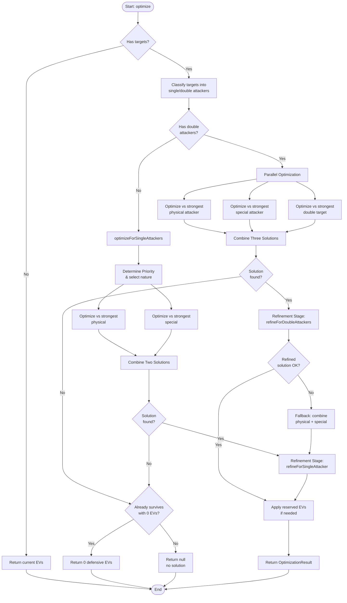

# Defensive EV Optimizer

## Overview

The Defensive EV Optimizer is a service that calculates optimal EV (Effort Value) distributions for defensive Pokémon in VGC (Video Game Championships) battles. It determines the minimum EV investment required in HP, Defense, and Special Defense to survive attacks from one or more opposing Pokémon.

The optimizer returns an `OptimizationResult` containing the optimized EVs and an optional nature recommendation. It supports a configurable `SurvivalThreshold` parameter (default: 2) to determine survival criteria: 1 = OHKO survival, 2 = 2HKO survival, etc.

## Architecture

The following diagram illustrates the complete optimization flow:

## Type System

The optimizer uses a well-defined type system for better code organization:

- **`OptimizationResult`**: Return type containing `evs: Stats | null` and `nature: string | null`
- **`OptimizationContext`**: Bundles `defender`, `field`, and `threshold` parameters
- **`AttackerContext`**: Contains physical/special attacker information and lists
- **`DoubleAttackerContext`**: Contains the two attackers for double target scenarios
- **`SolutionSet`**: Groups `physicalSolution`, `specialSolution`, and `doubleSolution`

## Main Algorithm

The optimizer follows this general flow:

1. **Target Classification**: Separates targets into single attackers and double attackers (two simultaneous attackers)
2. **Attacker Selection**: Identifies the strongest attacker(s) in each category (physical, special, double) and optionally determines the best defensive nature
3. **Individual Optimization**: Optimizes EVs for each strongest attacker independently
4. **Solution Combination**: Combines multiple solutions to find the optimal EV distribution that satisfies all requirements
5. **Refinement Stage**: Refines the solution to handle residual damage/recovery and prioritize HP investment

## Attacker Selection and Priority

The `AttackerSelector` service handles attacker classification and priority determination:

### Priority Determination

1. **Base Analysis**: Creates defenders with no EVs and maximum EVs to analyze which attackers can be survived
2. **Nature Analysis** (if `updateNature = true`): Tests both Defense-boosting and Special Defense-boosting natures
3. **Scenario Comparison**: Compares scenarios based on:
   - Total number of attackers survived
   - Maximum damage taken (as tiebreaker)
   - Attacker category composition (physical vs special)
4. **Result**: Returns the strongest attacker in each category and the optimal nature (if applicable)

## Single Attacker Optimization

When optimizing for a single attacker (physical or special):

1. **Find First Valid Solution**: Uses binary search to find minimum EV investment that allows survival
2. **Calculate Damage Product**: Computes HP × DEF (for physical) or HP × SPD (for special) as a measure of bulk
3. **Pre-calculate Values**: Pre-computes HP and DEF/SPD values for all EV intervals to optimize performance
4. **Generate Combinations**: Creates all valid EV combinations that meet the minimum damage product threshold (95% of initial)
5. **Sort by Total EVs**: Orders combinations by total EV investment (ascending)
6. **Test Combinations**: Tests each combination until finding one that ensures survival

### EV Intervals

EVs are distributed in "intervals" where stat values increase by 1 point. The interval sequence is:

`[0, 4, 12, 20, 28, 36, 44, 52, 60, 68, 76, 84, 92, 100, 108, 116, 124, 132, 140, 148, 156, 164, 172, 180, 188, 196, 204, 212, 220, 228, 236, 244, 252]`

This optimization reduces the search space significantly compared to testing every possible EV value (0-252).

## Double Attacker Optimization

When optimizing for two simultaneous attackers, the algorithm handles three scenarios:

### Both Physical Attackers

Similar to single attacker optimization, but tests survival against both attackers simultaneously. Uses HP and DEF only.

### Both Special Attackers

Similar to single attacker optimization, but tests survival against both attackers simultaneously. Uses HP and SPD only.

### Mixed Attackers (One Physical, One Special)

More complex optimization requiring HP, DEF, and SPD:

1. **Binary Search for Minimum HP**: Uses a heuristic function to find the minimum HP that has a valid solution
2. **Find Minimum DEF**: For the given HP, finds minimum DEF needed to survive the physical attacker
3. **Find Minimum SPD**: For the given HP, finds minimum SPD needed to survive the special attacker
4. **Test Combined Survival**: Tests if HP + minDEF + minSPD survives both attackers together
5. **Try Additional Combinations**: If minimum values don't work, tries slightly higher DEF/SPD combinations
6. **Full Search**: If heuristic fails, performs full search of all HP/DEF/SPD combinations

## Solution Combination

When multiple solutions exist (physical, special, and/or double), they must be combined:

### Three Solutions Combination

When dealing with physical, special, and double solutions:

1. **Check Double Solution Coverage**: Verifies if the double solution already satisfies physical and/or special requirements
2. **Discard Redundant Solutions**: Removes solutions that are already covered by the double solution
3. **Find Optimized Combined Solution**: Attempts to find a single solution that satisfies all requirements with minimum EVs
4. **Fallback Strategies**:
   - Try combining physical + special, then add double
   - Try combining physical with double
   - Try combining special with double
   - Return double solution as last resort

### Two Solutions Combination

When combining physical and special solutions:

1. **Find Optimized Combined Solution**: Attempts to find a single solution with minimum EVs
2. **Prioritize by HP**: If optimized solution not found, prioritizes the solution with higher HP
3. **Apply Remaining EVs**: Distributes remaining EVs (up to 508 total) to the other stat
4. **Verify Survival**: Tests that the combined solution survives all attackers

## Refinement Stage

The **Refinement Stage** is a critical post-optimization phase that handles edge cases involving residual damage or recovery. It consists of three sub-processes:

### When Refinement is Needed

Refinement is triggered when the KO chance text indicates:

- **Residual damage**: "after X damage" (e.g., from weather, entry hazards, Life Orb)
- **Residual recovery**: "after X recovery" (e.g., from Leftovers, Grassy Terrain)

For threshold 1 (OHKO survival), only residual damage triggers refinement. For threshold 2+, both residual damage and recovery trigger refinement.

### Increase EVs

When residual damage causes the initial solution to fail:

1. **Iterative Increase**: Adds EVs in increments of 4 to HP, DEF, or SPD (round-robin)
2. **Early Exit**: Returns immediately when survival is achieved
3. **Stat Limits**: Respects the 252 EV limit per stat
4. **Returns**: The first solution that survives, or `null` if no solution found

### Reduce EVs

When residual recovery makes the solution over-invested:

1. **Iterative Reduction**: Attempts to reduce HP, DEF, or SPD by 4 EVs (in order)
2. **Continuous Optimization**: Continues reducing as long as survival is maintained
3. **Returns**: The minimal solution that still ensures survival

### Prioritize HP

When facing only physical or only special attackers (not mixed):

1. **Identify Attack Type**: Determines if all attacks are physical or all special
2. **Calculate Total EVs**: Computes the total EVs invested in HP + relevant defensive stat
3. **Redistribute**: Attempts to maximize HP while maintaining the same total EVs
4. **Verify and Reduce**: Tests each redistribution and applies reduction if successful
5. **Returns**: The solution with maximum HP investment

This creates more efficient EV spreads by favoring HP (which provides general bulk) over DEF/SPD when possible.

## Internal Services

The optimizer is split into several internal services:

- **`EvIntervalsCalculator`**: Calculates EV interval values (0, 4, 12, 20, ..., 252)
- **`EvOptimizerUtils`**: Provides utility functions for:
  - Binary search for minimum EVs
  - Generating two-stat and three-stat EV combinations
  - Finding the best valid combination from a list
- **`SurvivalChecker`**: Handles damage calculations and survival checks for both single and double attackers
- **`AttackerSelector`**: Identifies strongest attackers, determines priority, and selects optimal nature
- **`SingleAttackerOptimizer`**: Optimizes EVs for single physical or special attackers
- **`DoubleAttackerOptimizer`**: Optimizes EVs for two simultaneous attackers
- **`SolutionCombiner`**: Combines multiple optimization solutions with sophisticated fallback strategies
- **`RefinementStage`**: Refines solutions to handle residual damage/recovery and optimize HP distribution

## Constants

The optimizer uses the following constants (defined in `ev-optimizer-constants.ts`):

- **`MAX_TOTAL_EVS`**: 508 (maximum total EVs across all stats)
- **`MAX_SINGLE_STAT_EVS`**: 252 (maximum EVs in a single stat)
- **`MIN_DAMAGE_PRODUCT_MULTIPLIER`**: 0.95 (95% threshold for damage product filtering)

## Performance Optimizations

1. **Pre-calculation**: HP, DEF, and SPD values are pre-calculated for all EV intervals to avoid repeated calculations
2. **Binary Search**: Used to find minimum valid solutions quickly
3. **Early Termination**: Stops searching once a valid solution is found
4. **Damage Product Filtering**: Reduces search space by filtering combinations below the threshold
5. **Sorting**: Combinations are sorted by total EVs to find minimum investment first
6. **Mutable Setters**: Uses `setEvs()` method instead of cloning within tight loops for performance
7. **EV Intervals**: Only tests EV values that result in stat changes, reducing search space by ~85%

## Reserved EVs Support

The optimizer supports preserving offensive EVs when `keepOffensiveEvs = true`:

1. **EV Reservation**: Preserves the defender's existing ATK, SPA, and SPE EVs
2. **Total EV Validation**: Ensures defensive + offensive EVs don't exceed 508 total
3. **Result**: Returns `null` if the total exceeds the limit, otherwise combines both

## Limitations

- **Maximum total EVs**: 508 (as per Pokémon rules)
- **Only optimizes HP, DEF, and SPD**: Other stats (ATK, SPA, SPE) can be preserved via `keepOffensiveEvs` but are not optimized defensively
- **Assumes maximum damage rolls**: Survival calculations use worst-case damage for safety
- **Does not account for critical hits**: Critical hit probabilities are not factored into survival calculations
- **Residual damage handled via refinement**: Initial optimization may not account for residual damage/recovery; the refinement stage corrects this
- **Nature selection limited to defensive natures**: Only considers Defense-boosting or Special Defense-boosting natures when `updateNature = true`
